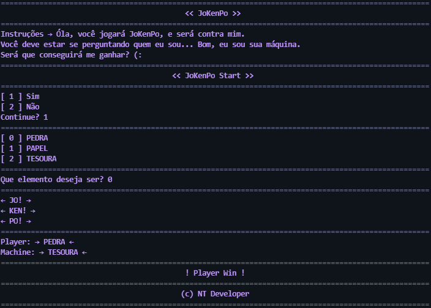
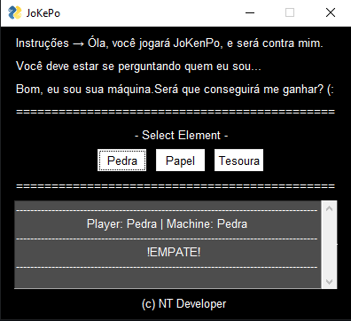

# JoKenPoPy

---
## 🗂 Project description

	It is a simple game of JoKenPo, in text format, in which it can be played by the terminal.

---
### 🖼 Image project

#### JoKenPo-v1

#### JoKenPo-v2

---
### 🛠 Technology

<li> Python
<li> PySimpleGUI

---
### 💾 Instalação

<h5>Mac e Linux</h5>

~~~ Bash
    python3 -m pip install PySimpleGUI
    or
    pip3 install PySimpleGUI
~~~

<h5>Windows</h5>

~~~ PowerShell
    python -m pip install PySimpleGUI
~~~

---
### ✔ Status

<h4>Building!</h4>

<footer align="center" >&copy; NT Developer</footer>

